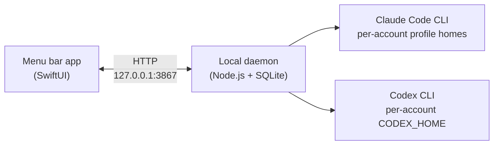

<div align="center">

# ModelDeck

**One menu bar icon that always knows how much Claude Code and Codex you have left.**

A native macOS menu bar app + local daemon that tracks usage limits across
all of your Claude Code and Codex CLI accounts — live "% left" meters,
reset countdowns, and optional account switching.

**Local-first. No cloud backend. No telemetry. Your provider credentials
are never copied, stored, or transmitted by ModelDeck.** The only secrets
ModelDeck creates are its own local Keychain items — the token that guards
the daemon's API and, if you use the managed proxy, a client key per
profile — and they contain nothing of yours. The only optional outbound calls of
ModelDeck's own are the daily update check (reads this repository's public
releases feed) and the update download you approve (fetches the release
asset) — update checks are off unless you enable them.

[Download](https://github.com/timharris707/modeldeck/releases) ·
[modeldeck.ai](https://modeldeck.ai)


</div>


*All screenshots show a demo-seeded instance with placeholder accounts.*

---

## Why

If you run AI coding agents seriously, you probably don't have *one*
account — you have a work Claude Max plan, a personal Pro plan, a Codex
subscription, maybe a spare for side projects. Each one has its own
5-hour session window, weekly limit, and model-scoped caps, all resetting
on different clocks.

Today the only way to know where you stand is to interrupt what you're
doing and check each account by hand — usually right after an agent run
dies mid-task because a limit you forgot about ran out.

ModelDeck puts all of it in your menu bar:

- **See every limit at once.** Every account, every window (5-hour session,
  weekly, model-scoped like "Weekly · Fable"), as a live "% left" meter with
  its next reset time.
- **Get warned before you hit the wall.** The menu bar icon shows a gold
  percentage when any account drops below your threshold, red when critical,
  and a macOS notification fires exactly once at the crossing — no nagging.
- **Account switching is offered when you add a second login** — with one login per provider, ModelDeck never touches that provider’s home folder.

## Features

- **Multi-account usage deck** — a popover with one card per account:
  worst-window headline bar, plan tier ("Max (20x)", "Pro"), and expandable
  detail rows for every rate-limit window with right-aligned reset times
  ("Resets Wed 5:59 PM PDT") in your time zone.
- **Both providers, side by side** — Claude Code and Codex CLI columns with
  their brand marks, or a single-column layout if you prefer. Sort by next
  reset, lowest remaining, or provider.
- **Model-scoped weekly limits** — per-model caps are parsed and shown as
  first-class meters, not buried in a tooltip.
- **Account activation with honest states** — each provider has one active
  account for *new* terminal sessions. Activation atomically swaps isolated
  per-account profile homes, then verifies the result and reports it
  truthfully (`effective` / `identity-mismatch` / `identity-unverified`)
  instead of assuming success. Running sessions are never stopped, logged
  out, or touched.
- **Duplicate-token warning** — if two accounts of either provider end up
  sharing the same credential (a missed `/login` ceremony, a copied
  profile), the deck flags them with a warning marker and banner instead of
  silently counting the same limit twice.
- **Isolated profile homes** — every account lives in its own owner-only
  config home (`CLAUDE_CONFIG_DIR` / `CODEX_HOME`), macOS Keychain-aware,
  so identities never bleed into each other.
- **Transition-only notifications** — a banner when an account *crosses*
  your remaining-% threshold, silence otherwise. Thresholds configurable.
- **Menu bar at-a-glance state** — plain glyph when healthy, gold "% left"
  beside it when anything is low, red at critical, back to plain on recovery.
  Or pin one account (or "the active account") from Settings or a card's
  right-click menu and its percentage stays in the menu bar continuously.
- **Guided add-account flow** — three steps: name it, sign in through the
  provider's own browser login, confirm the identity ModelDeck read back.
  ModelDeck never sees your password or token.
- **CLI health** — installed vs. latest versions of Claude Code and Codex
  CLI, with auth-state chips per account ("Healthy" / "Sign in again").
- **Launch at login and one-click updates** — start with your Mac, and
  optionally check the public releases feed daily for new versions. When one
  is found, **Update Now** downloads, verifies (EdDSA + Apple signature),
  installs, and relaunches in one click; an "Install updates automatically"
  toggle (on by default once checks are enabled) installs quietly on the
  next relaunch instead. Turn checks off and ModelDeck never phones out.


## Privacy: local-first, by design

This is the point of the tool, so it's worth being explicit:

| | |
|---|---|
| Cloud services | **None.** No backend, no sync, no accounts. |
| Telemetry | **None.** Nothing is phoned home, ever. |
| Provider credentials | Sign-in happens in the provider's own browser flow; credentials stay in the profile/Keychain. The one-time Codex profile directory migration moves existing homes into ModelDeck's data directory and retains an owner-only recovery backup there. |
| ModelDeck's own secrets | A few Keychain items of its own, all locally generated: one random token that authorizes the app to the daemon's localhost API, plus — only if you use the managed proxy — one client key per profile (service `cli-proxy-api-client.<profile>`) that ModelDeck mints for its own local proxy. None contain provider data. |
| Network | Daemon binds to `127.0.0.1` only. Outbound calls go solely to the providers you already use, with credentials they already hold. |
| Removal | Removing an account deletes only ModelDeck's reference. Deleting ModelDeck's data directory also deletes its managed Codex profiles and migration backups; Keychain entries remain. Custom profile-directory overrides must be removed separately. |

## Install

**Requirements:** macOS 14+ and the Claude Code and/or Codex CLIs you want
to track. (Node.js is only needed if you build from source.)

**1. Download the app**

Get the latest signed, notarized DMG from the
[Releases page](https://github.com/timharris707/modeldeck/releases), open
it, and drag ModelDeck to Applications.

**2. Launch it**

The DMG is self-contained: on first launch ModelDeck asks your consent to
register its bundled background service (the local daemon that does the
actual usage reads, listening on `127.0.0.1:3867` only) and sets up its
Keychain token — one approval, no Terminal.

**3. Add accounts**

Open **Settings → Accounts → Add Account** and follow the three-step flow
for each account — e.g. "Work", "Personal", "Side Project". Each gets its
own isolated profile home and signs in through the provider's own login
flow.

## Uninstall

Removing the app keeps its data for a reinstall. Optional data deletion below
also removes managed profile homes and their sign-ins. Quit provider sessions
first and keep a backup of any profiles you want to retain.

**If you installed the DMG**

1. Quit ModelDeck (menu bar icon → right-click → Quit ModelDeck).
2. Drag ModelDeck from Applications to the Trash. The background service
   and the launch-at-login entry live inside the app bundle, so removing
   the app removes them too — no Terminal needed.
3. Optionally, delete the data ModelDeck kept (skip this if you might
   reinstall — it's what makes a reinstall pick up where you left off):
   - `~/Library/Application Support/ModelDeck` — settings, usage history,
     and isolated per-account profile homes, including `codex-profiles` and
     its migration backups. Deleting it removes those managed sign-ins;
     activation symlinks such as `~/.codex` may then point at a missing home.
     The migration leaves the empty `~/.codex-profiles` directory for you to
     remove. If you use `MODELDECK_DATA_DIR`, `MODELDECK_DB_PATH`, or
     `MODELDECK_CODEX_PROFILES_DIR`, remove those configured locations instead.
   - `~/Library/Preferences/app.modeldeck.mac.plist`,
     `~/Library/Caches/app.modeldeck.mac`, and (if you ever ran the
     from-source launch agent) `~/Library/LaunchAgents/ai.hermes.modeldeck.plist`.

**If you installed via Homebrew**

```bash
brew uninstall modeldeck
```

removes the app and leaves your data in place for a reinstall. To delete
the data as well (same caveat about managed account profiles as above):

```bash
brew uninstall --zap modeldeck
```

**Keychain items (both install methods)**

Neither the Trash nor `--zap` can remove Keychain items, so two kinds may
remain — both are ModelDeck's own locally generated secrets, containing
nothing of yours. Open **Keychain Access**, search for `modeldeck` and
`cli-proxy-api-client`, and delete what turns up; or from Terminal:

```bash
security delete-generic-password -s modeldeck -a mutation-token
```

The `cli-proxy-api-client.*` items exist only if you used the managed
proxy feature, one per profile; delete each with
`security delete-generic-password -s "cli-proxy-api-client.<profile>" -a ""`.

## How it works



- **The app** (`macos/ModelDeckMac/`) is a SwiftPM `MenuBarExtra` app — no
  Xcode project, no Electron. It is a pure client of the daemon's
  localhost API.
- **The daemon** (`src/`) is API-only: it binds to `127.0.0.1`, rejects
  unexpected Host/Origin headers, and requires a per-server token plus a
  `SameSite=Strict` cookie for every mutation. State lives in an owner-only
  SQLite database under `~/Library/Application Support/ModelDeck/`. The old
  control-plane web UI is retired: the native app drives everything the
  daemon does. Its one remaining page is the read-only usage dashboard at
  `/dashboard`, served on the same loopback listener behind the
  `usageAnalyticsEnabled` setting and opened from the app.
- **Usage reads** go through each provider's own channel: Codex via the
  official `codex app-server` stdio protocol, Claude via Anthropic's native
  usage endpoint using only the credential already stored in that profile —
  ModelDeck never initiates logins, never refreshes tokens, and never
  persists credentials.

## Development

Building from source instead of using the released DMG (requires Node.js
24+ for the daemon):

```bash
# daemon (foreground)
npm install
npm start                             # daemon on 127.0.0.1:3867

# app
cd macos/ModelDeckMac
swift run ModelDeckMac
```

To keep a checkout's daemon running across logins instead of the bundled
one, install it as a launch agent:

```bash
scripts/set-mutation-token.sh                # one-time Keychain token setup
scripts/install-launch-agent.sh --port 3867  # installs + starts the launchd agent
```

Or assemble a signed `.app` bundle (ad-hoc by default):

```bash
macos/ModelDeckMac/Scripts/build_app.sh
```

The usage dashboard (`/dashboard`, behind the `usageAnalyticsEnabled`
setting) is a React app in `dashboard/`, compiled to ONE self-contained HTML
file and inlined into `src/dashboard-app.mjs` — a committed build output the
daemon serves and the single-file binary carries. Edit `dashboard/`, then:

```bash
npm run dashboard:build               # regenerate src/dashboard-app.mjs
npm run dashboard:dev                 # Vite + HMR against a daemon on :3867
```

`npm test` fails if the committed artifact is older than the sources.

Tests:

```bash
npm test                              # daemon test suite
cd macos/ModelDeckMac && swift test   # app test suite
```

See [`macos/ModelDeckMac/README.md`](macos/ModelDeckMac/README.md) for the
app package layout, [`DESIGN.md`](DESIGN.md) for the daemon's safety
contract and architecture decisions, and [`docs/RELEASE.md`](docs/RELEASE.md)
for how release DMGs are cut.

## Roadmap

The native app is the interface for everything the daemon does; the
read-only usage dashboard at `/dashboard` is the one browser page.
Release history lives in
[`CHANGELOG.md`](CHANGELOG.md), with the app design authority in
[`design/mac-app-spec.md`](design/mac-app-spec.md). Project news lands at
[modeldeck.ai](https://modeldeck.ai).

## License

ModelDeck is source-visible and free for personal, noncommercial use under
the [PolyForm Noncommercial License 1.0.0](LICENSE.md): read the code, build
it, run it on your own machine, and share it noncommercially. Commercial
rights are reserved by the author — if you want to use ModelDeck
commercially, open an issue and ask.

## Contributing

Issues and pull requests are welcome — contributions are accepted under the
same [license](LICENSE.md) as the project. Bug reports with the daemon's
`/api/health` output and your macOS + CLI versions are especially useful.
Please don't include real account identities or usage data in issues —
placeholder labels are fine.
